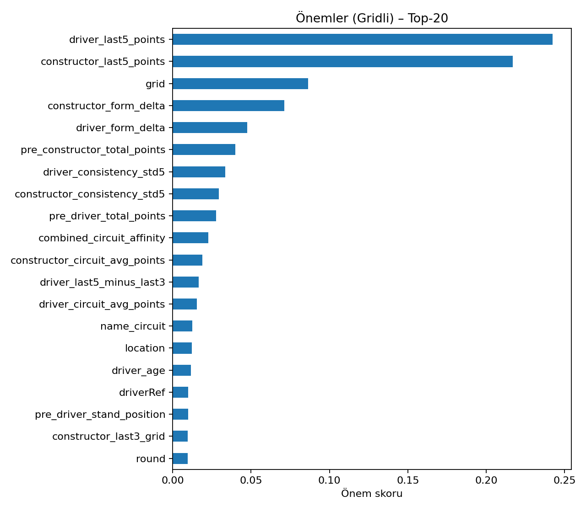
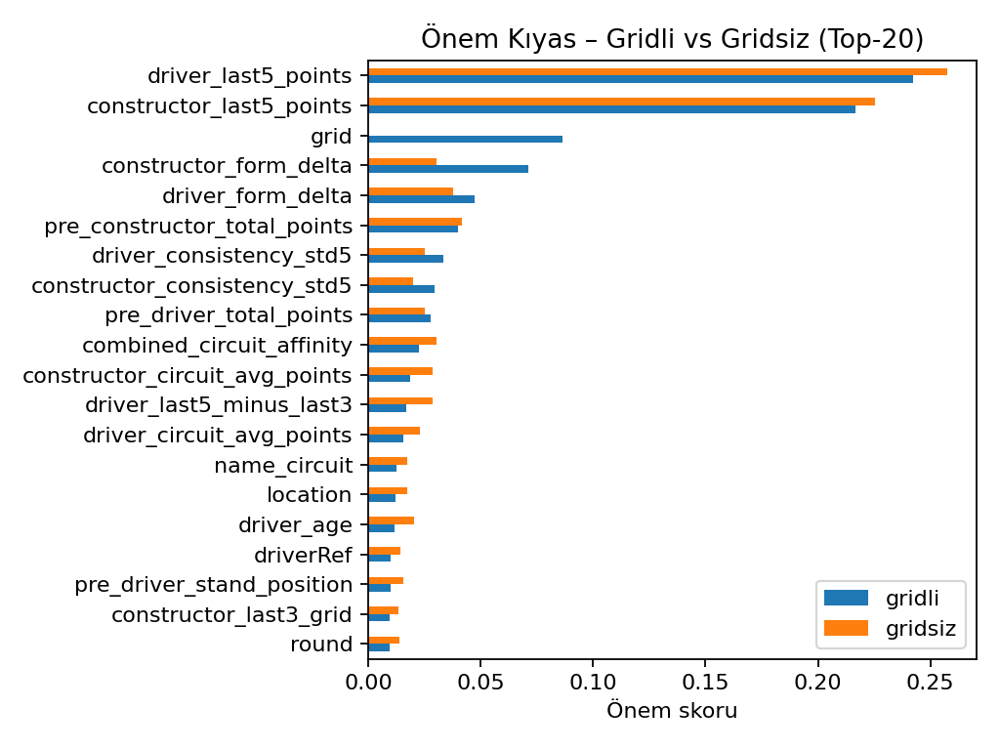
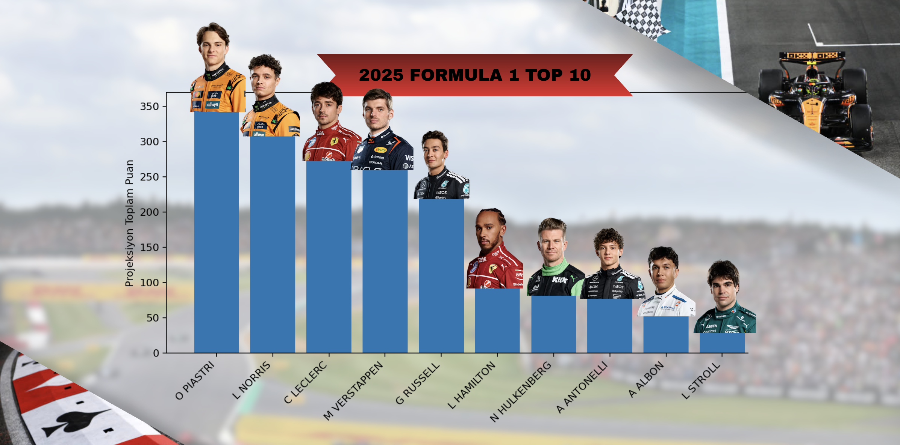

# 🏎️ FORMULA 1 – 2025 Proxy-Grid Season Points Prediction

A modern Machine Learning pipeline for predicting F1 driver points / Proxy-Grid standings and projecting season outcomes (including Monte Carlo simulation).
---

## 🚀 Features
	•	Feature engineering with Ergast/Kaggle data (fe.py)
	•	RandomForest model and feature importance (modeling.py)
	•	Season-level metrics: precision@10, Spearman, RMSE/MAE/R² (eval.py)
	•	2023–2024 historical season tests
	•	2025 live predictions + Monte Carlo projection (simulate.py)
	•	Output tables and visualizations (outputs/figs/)

---

## ⚙️ Setup

### 1) Environment Setup

###### python -m venv .venv
###### source .venv/bin/activate   # Windows: .venv\Scripts\activate
###### pip install -U pip
###### pip install -e .

### 2) Sample Data

#### To generate a small demo CSV:

python tools/make_sample_data.py 
export F1_LIVE2025_DIR="$(pwd)/data/sample"
export F1_ARCHIVE_DIR="$(pwd)/data/sample"

### 3) Real Data
    •	Historical data → Kaggle
	•	2025 data → Kaggle / Ergast sources
	•	⚠️ Do not commit large datasets to the repo.
	•	Point environment variables to your own local folders:

export F1_LIVE2025_DIR="/path/to/Live_2025"
export F1_ARCHIVE_DIR="/path/to/archive_all"

### ▶️ Usage

#### 1) Full pipeline (train + test + projection)
python -m f1proj.cli --mode run-all --skip-kaggle --skip-fastf1

#### 2) Train + Test only
python -m f1proj.cli --mode train-test

#### 3) 2025 season projection (with Monte Carlo)
python -m f1proj.cli --mode simulate-2025 --skip-fastf1

## 📊 Example Outputs

### Feature importance – Grid-based model

### Feature importance comparison – Grid vs No-Grid

### Top-20 Visualized

### 2025 Monte Carlo Simulation


📈 Metrics (2023–2024)

| Yıl  | RMSE | MAE  | R²   | Precision@10 | Spearman |
|------|------|------|------|--------------|----------|
| 2023 | 4.49 | 3.00 | 0.62 | 1.0          | 0.977    |
| 2024 | 4.42 | 2.76 | 0.63 | 0.9          | 0.968    |

### 📂 Project Structure

f1-2025-proxy-grid/
├── data/
│   ├── raw/        # (opsiyonel) büyük veri, repoya koymayın
│   ├── sample/     # küçük örnek csv’ler (demo)
├── outputs/
│   ├── figs/       # çıktı görselleri
│   ├── tables/     # çıktı tabloları
├── src/f1proj/
│   ├── cli.py
│   ├── config.py
│   ├── data_io.py
│   ├── fe.py
│   ├── modeling.py
│   ├── eval.py
│   ├── simulate.py
│   ├── viz.py
├── tools/
│   ├── make_sample_data.py
├── tests/
├── pyproject.toml
├── README.md


## 🔍  FAQ / Troubleshooting

1.	“Data not found” error
👉 Make sure environment variables (F1_LIVE2025_DIR, F1_ARCHIVE_DIR) are set correctly.
	2.	2023–2024 Top-10 lists are empty
👉 Verify your dataset paths. Sample data is demo only; you must acquire full datasets yourself.
	3.	Images not visible in README
👉 Ensure .gitignore excludes everything in outputs/ except outputs/figs/.
	4.	sklearn “squared” parameter error
👉 Older sklearn versions don’t support squared=False. The project falls back to manual RMSE calculation.

🤝 Contributing

Contributions, issues, and pull requests are welcome!

📜 License

MIT License
```bash